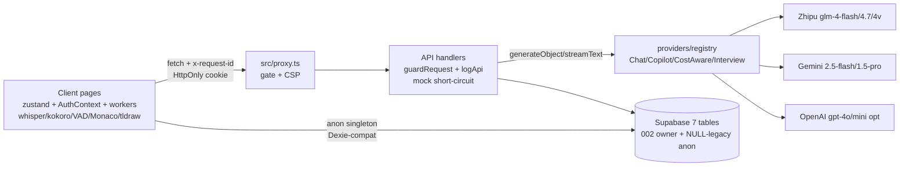

# Interve AI — ARCHITECTURE_CURRENT (Phase 1, HEAD f37f574)

> Date: 2026-09-03. Read-only audit. No src/ modified.
> HEAD: `f37f5747396eb8cc6dfdc5296a8f64a3d11b1f7b` on `main`.
> Stack: Next.js 16.2.4 / React 19.2.4 / TS 5 strict / AI SDK 6.0.168 / Zhipu GLM + Gemini + OpenAI optional / Supabase Postgres / zustand + Context + Orama / next-pwa / Whisper + Kokoro workers / Monaco + tldraw / recharts.

## 1. System overview

`Setup → Supabase interviews → Interview (audio + Monaco + tldraw + Fake Vision → Zhipu Panel stream → STAR/behavior/chunk) → analyze-interview (council + hireVerdict) → Dashboard/Report/Replay`. Auth/PWA/Vision are mock or degraded.

```mermaid
graph TB
  User([Browser Camera/Mic]) --> Proxy[src/proxy.ts Cookie gate + CSP]
  Proxy --> App[Next.js 16 App Router layout + providers]
  App --> InterviewUI[src/app/interview/page.tsx 1678 lines useChat + workers]
  App --> SetupUI[src/app/setup/page.tsx 1295 lines wizard + PDF]
  App --> DashUI[src/app/dashboard report/replay/charts]
  App --> PracticeUI[src/app/practice Server/Client split - only clean boundary]
  App --> RecruiterUI[src/app/recruiter Mock]
  InterviewUI --> Whisper[src/workers/whisper.worker.ts Xenova/whisper-base]
  InterviewUI --> Kokoro[src/workers/kokoro.worker.ts Kokoro-82M ONNX]
  InterviewUI --> NativeAudio[MediaRecorder + SpeechRecognition + speechSynthesis + energy VAD]
  InterviewUI --> FakeVision[VisionTelemetry Math.random eye/posture/expression]
  InterviewUI --> API[16 Route Handlers edge+node, no auth/rate-limit]
  SetupUI --> API
  API --> Zhipu[Zhipu glm-4-flash/4.7-flash/4v-flash/4v-plus]
  API --> Gemini[Gemini 2.5-flash / 1.5-pro]
  API --> OpenAI[GPT-4o-mini/4o fallback]
  API --> Supabase[(Supabase 7 tables, RLS USING true, no user_id)]
  App --> Auth merkez[Auth triple-track Broken: context/AuthContext live-cookie vs lib/auth-context dead-mock vs lib/auth dead-OAuth]
  App --> State zustand[useInterveStore + useAppStore overlap + useAccessibilityStore persist]
  App --> PWA[next-pwa manifest start_url:/dashboard, no runtimeCaching]
  App --> Obs[telemetry fetch-patch + SystemTelemetry + console 40+]
```

## 2. Subsystems

### 2.1 Frontend / RSC boundary — Partial, over-clientized
- Only clean Server/Client split: `src/app/practice/[id]/page.tsx` (Server) + `client.tsx:1-183` (Client). Correct pattern, not followed elsewhere.
- Root `src/components/providers.tsx:1` is `"use client"`, whole tree loses RSC. `src/app/dashboard/layout.tsx:1`, `src/app/loading.tsx:1` unnecessarily client. `useCodeExecutor.ts:1`, `useKeyboardShortcuts.ts:1` misuse `"use client"` in hooks files. `ui/*` ~30 atoms all client. `grep "use client"` 100+ hits.
- Risk: first-paint JS bloat, lost layout caching.

### 2.2 Route Handlers (16) — Partial
`interview-chat:195`, `analyze-interview:157`, `analyze-trends:121`, `init-context:90`, `parse-resume:81`, `analyze-star/match:74`, `copilot:73`, `analyze-code:64`, `analyze-chunk:56`, `analyze-vision:54`, `analyze-alignment:52`, `analyze-behavior:48`, `generate-hint:46`, `parse-jd:43`, `analyze-practice:36`. No giant handler, but `interview-chat:62-140` system prompt overlong.
- All `POST(req:Request)` with manual `if(!x) return 400`. No Zod inputs. 8 Zod outputs, 5 routes no schema.
- `runtime edge` mixed with Node (`parse-resume` needs Buffer). `analyze-vision:39 new URL(imageBase64)` throws on data-URL — Broken risk.
- 13× `// @ts-expect-error compatibility flag` for unofficial `compatibility:'compatible'` Zhipu passthrough — fragile coupling, single-point extraction needed (`lib/zhipu.ts`).

### 2.3 Database — Partial, drifted
- `supabase/migrations/0001_initial_schema.sql` (88 lines, UUID, JSONB, no RLS/indexes, non-idempotent) vs `001_init_schema.sql` (236 lines, BIGSERIAL, TEXT[], defaults+CHECKs, 11 indexes, trigger). Same 7 tables, incompatible types. `001 IF NOT EXISTS` never repairs types. Frontend assumes `id?:number` (`db.ts:20`) + `Number(id)/parseInt` (`report/[id]:95`, `replay/[id]:35`, `interview:468`).
- `lib/supabase.ts:1-7` anon singleton with `placeholder.supabase.co` silent fallback. `lib/api-client.ts:1-288` Dexie-emulation (`where/equals/sortBy`) with file-level `/* eslint-disable */` + 30 `any`. `lib/db.ts:141 export {db=dbClient}` alias; callers mix `@/lib/db` and `@/lib/api-client`.
- Zero FKs, zero `user_id`. `evaluations.candidate_id TEXT`, `practice_sessions.question_id TEXT` dangling.

### 2.4 Auth — Broken (triple-track)
- Live: `src/context/AuthContext.tsx:27-39` localStorage+cookie JSON, no password, no HttpOnly/Secure/sign/expire. `proxy.ts:34 JSON.parse(cookie).id` existence check — forge `{"id":"x"}` bypasses.
- Dead: `src/lib/auth-context.tsx` (`interve_auth_user` mock), `src/lib/auth.ts` (Supabase OAuth never wired), `src/lib/auth/auth.ts` (`export {}`).
- `LoginForm.tsx:42-56` discards password. `signup/page.tsx:19-38` same + hardcoded `oauth_user@example.com`.

### 2.5 AI Provider — Partial
- Zhipu primary (`glm-4-flash/4.7-flash/4v`), Gemini (`2.5-flash/1.5-pro`), OpenAI optional. Model IDs hardcoded across 13 files (`gemini-2.5-flash` vs `models/gemini-2.5-flash` inconsistent). `thinking+max_tokens=65536` fetch hack duplicated in 4 files. Cost-aware routing by char length (`analyze-interview:35-38`, `init-context:71`, `analyze-match:36`) with `console.log([Cost-Aware])`.

### 2.6 AI Evaluation — Partial, no harness
- `generateObject+zod` for STAR/behavior/code/practice/alignment/JD/context. `temperature:0.1` only in `analyze-code:48`. No eval harness, ground truth, regression set. `analyze-chunk/star/behavior` fire-and-forget `.catch(console.error)`. `question-bank.ts` 17 static mocks, Orama search possibly dead.

### 2.7 Audio — Partial
- `interview/page.tsx:158-921` orchestrates MediaRecorder + SpeechRecognition + speechSynthesis(ZH) + Kokoro(EN) + Whisper. Three concurrent mic holders (main + VAD + AmbientNoise) risk multi-prompt/echo. ZH detection ` /[\u4e00-\u9fa5]/:249` coarse.
- `whisper.worker.ts` Xenova/whisper-base WebGPU-fp16→WASM-q8, chunk30s/stride5s, hundreds of MB download. `kokoro.worker.ts` 82M ONNX q8 `af_heart`. Main-thread `addEventListener` never removed (`page.tsx:614-615`), `terminate` with 200ms race.

### 2.8 Vision — Mock (human) / Partial (whiteboard)
- `VisionTelemetry.tsx:25 getUserMedia 320x240` preview only; `:48-59 Math.random()` eye/posture/expression every 2s → `onVisionDataUpdate` → `bodyLanguageScore` persisted (`page.tsx:735-743`). `TelemetryWidget.tsx:40` focus random. `SystemHealthIndicator.tsx:21` latency random.
- `analyze-vision glm-4v-plus` real but only for tldraw snapshot; `SystemDesignBoard.tsx:196 persistenceKey` global — cross-session leak.

### 2.9 Storage — Partial
- No Supabase Storage; resume PDF/audio blobs never cloud-stored (good). `localStorage interve_session_${id}` full transcript (5MB quota risk, silent catch). Scratchpad/design keys hardcoded, no namespace versioning. Only `useAccessibilityStore:16-28` uses `persist` correctly. `public/pdf.worker.min.mjs` postinstall copy is good.

### 2.10 State — Partial, overlapping
- `useInterveStore` vs `useAppStore` duplicate `resumeText/jdText/cheatsheet`. `interview/page.tsx:131-230` ~15 local states, no reducer. Transport body snapshots `getState()` at render (`page.tsx:220-240`) — stale context. Orama singleton no lock, dual init (`page.tsx:139-143` + `622-624`).

### 2.11 Caching — Missing (except 1)
- Only `analyze-code:54 Cache-Control s-maxage=3600`. Rest no cache, dashboard `select('*')` every load. Orama full rebuild, no incremental/version.

### 2.12 Workers — Partial
- Turbopack `new Worker(new URL(...import.meta.url))` unverified. No COOP/COEP. `transfer:[buffer]` zero-copy correct but detached-reuse risk.

### 2.13 PWA — Partial
- `disable:dev` blocks dev verification. `start_url:/dashboard` flash-jumps to `/login`. No `runtimeCaching` for Whisper/Kokoro, no offline fallback, no screenshots/shortcuts.

### 2.14 Observability — Prototype
- `telemetry.tsx` monkey-patches `window.fetch`, HMR stacking risk, self-recursion risk unconfirmed. `SystemTelemetry` full-table pull, no sampling. `TelemetryWidget/LiveStats` mock/derived numbers. 40+ `console.*`, no Sentry/OTel, possible resumeText in logs.

## 3. Top architectural debts (Phase 2 must-fix)
1. Triple Auth + naked AI APIs (billing/security).
2. 1678-line interview God Component + stale transport snapshot + mic/Worker listener leaks.
3. Fake vision persisted as score (integrity).
4. `analyze-vision new URL()` crash bug.
5. `api-client` lint-disabled + 30 `any` type hole.

## 4. Phase 1 refresh 2026-09-14 (HEAD `bc69d30`, read-only subagents)

> Supersedes §1-§3 where conflicted. Phase 2-13 train landed uncommitted since `f37f574`: many §2 "Broken" items are now fixed in tree.

- **Routes (19 pages, 18 APIs):** only `practice/[id]/page.tsx` (Server `generateStaticParams` + `await params`) + root `layout.tsx` are Server; rest Client-first. APIs: `session` (HMAC HttpOnly, only `requireSession:false`) + 17 POST all via `guardRequest` (requestId→IP limit→session→maxBytes+Zod, default 25s, chunk 120s/interview 170s). `E2E_MOCK` short-circuit via `mock.ts`.
- **AI core:** `src/ai/providers/registry.ts` single-site clients (`zhipu glm-4-flash/4.7 + 4v`, `gemini 2.5-flash/1.5-pro`, `openai` optional) + `resolveChat/Copilot/CostAware/Interview` + `DEFAULT_MAX_RETRIES=2/FALLBACK=1` + `withModelFallback`; `src/ai/prompts/` 19 versioned + `PROMPT_REGISTRY`; `rubrics/` 5 anchored + `evaluation-contract.ts` (evidence≥1, 1-5, confidence=evidence-sufficiency); interview loop server-rebuilds `InterviewState v1` per turn + `coverage.ts` + `difficultyHint ±1`.
- **DB/Auth/State:** Supabase 7 tables via `api-client.ts` Dexie-emulation over anon singleton (no server DB path — all API routes are LLM-only); HMAC cookie `{v:1,id,email,username,iat,exp/24h}` + `src/proxy.ts` named `proxy` (+CSP/nosniff/DENY/HSTS); zustand×3 (`useInterveStore`/`useInterviewLoopStore`/`useAccessibilityStore` persist incl. `showLiveInsights=false` default) + `AuthContext` server-authority + Supabase-OAuth bridge; Orama memory + `orama_index` persist.
- **Media:** triple-stream audio (recorder+VAD+ambient, echo cancel, device picker, GreenRoom gate + text bypass, `SttSession` bounded restarts, Kokoro/OS TTS barge-in stop, `summarizeDelivery` nulls-never-guess); camera = local self-view only (`VisionTelemetry` DELETED, zero metrics); whiteboard/code via `analyze-vision data:image/*`-only + Monaco + tldraw drawer-gated `dynamic ssr:false`.
- **Fixed since §1:** proxy named-export + coverage, session-gated + rate-limited APIs, fake-vision deletion, V2 eval generation (legacy display fidelity only), `002` ownership migration + static RLS contract, CI `ci.yml` + 201-test gate, PWA shell + `output:standalone`.
- **Still open:** lint 859e/13301w (dirty tree), 9 unfenced prompt builders, match/alignment dup, 0-100 non-V2 lanes, NULL-legacy anon bridge + global `orama resume-index` + no server purge, i18n <20%, axe 3-page only, CI smoke-only matrix.


